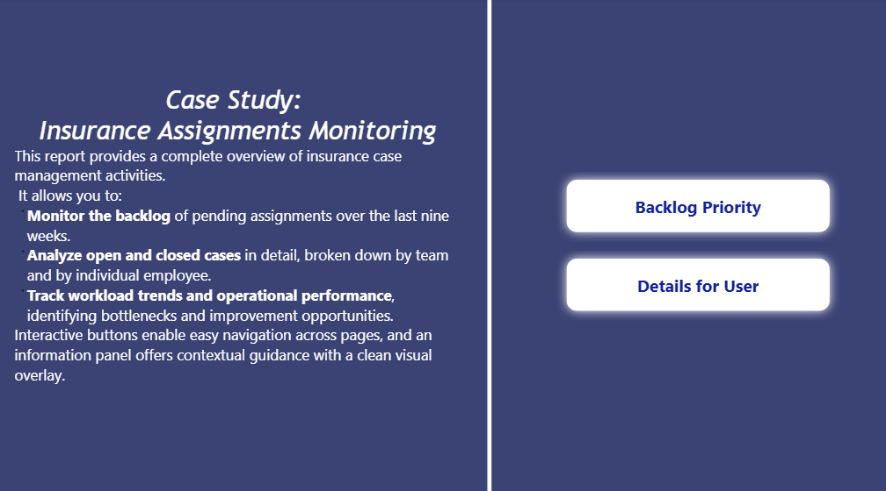
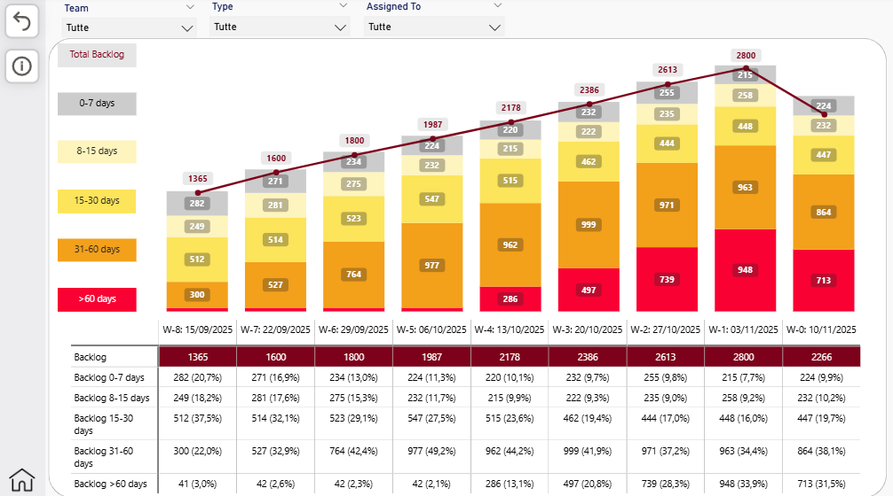
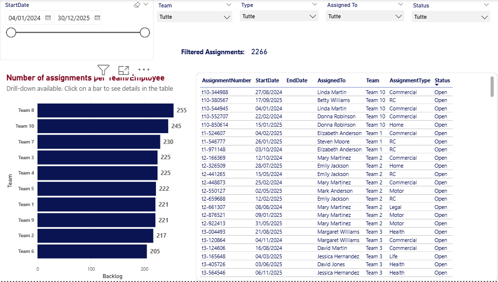
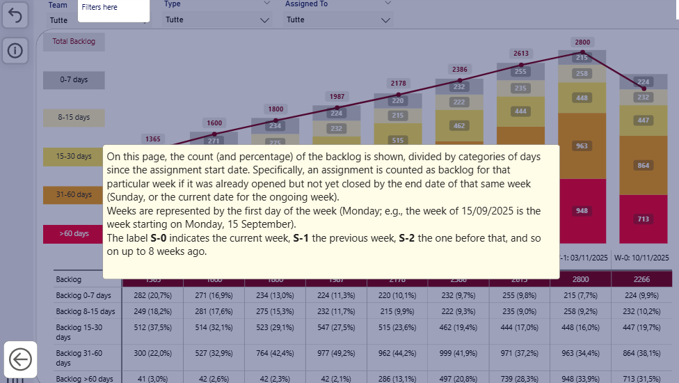

# 📊 Insurance Assignments Monitoring Dashboard  
### Case Study & Interactive Reporting

This repository contains a Business Intelligence dashboard designed to monitor and analyze insurance case management activities.  
The solution provides a clear and interactive view of backlog trends, assignment details, team performance, and workload distribution.

The dashboard is available in both Power BI (.pbix) and Excel formats and includes interactive navigation elements and an information panel that enhances user experience.

---

## 🎯 Objectives of the Dashboard

The dashboard was developed to support insurance operations teams in:

- **Monitoring the backlog** of pending assignments over the last nine weeks  
- **Analyzing open and closed cases** by team and by employee  
- **Tracking workload trends and operational performance**  
- **Identifying bottlenecks** and possible areas for improvement  
- **Navigating efficiently** through pages thanks to custom-designed buttons  
- **Understanding dashboard metrics** through a dedicated on-page **Information Panel**  

It is both a functional operational tool and an example of clean, professional BI design.

---

## 🏠 Home Page

The Home Page introduces the case study and lets the user access the two main areas of the report through intuitive navigation buttons.

---

## 📌 Backlog Monitoring (Last 9 Weeks)

The first section focuses on the **weekly backlog trend**, showing how many assignments remained pending at the end of each week, categorized by delay range.

### Key insights include:
- Total backlog per week  
- Aging categories (0–7, 8–15, 15–30, 31–60, >60 days)  
- Trend line highlighting backlog evolution  
- Percentage-based breakdown table  
- Filters by team, type, and assigned employee  

---

## 👥 Team & Employee Details

The second section provides a detailed view of **active and completed assignments**, allowing users to analyze workloads at both team and individual level.

### Features:
- Assignments per team and per employee  
- Drill-down enabled bar charts  
- Global filters: date range, team, type, assigned user, status  
- Detailed table with assignment metadata (start date, end date, type, team, status)  

---

## 🧭 Interaction & UX Features

The dashboard includes several improvements to ensure smooth navigation and clarity:

### 🔹 Custom Navigation Buttons  
Enable fast movement between pages without using the default Power BI interface.

### 🔹 Information Panel (Info Button)  
A dedicated **info button** opens an overlay panel that dims the dashboard and shows contextual explanations.  
This helps the user understand metrics, filters, and visualizations without leaving the page.

